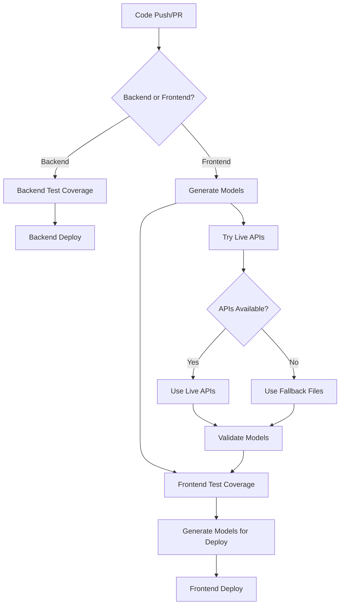

# CI/CD Pipeline with Model Generation

This document describes the integrated CI/CD pipeline that automatically generates TypeScript models from backend Swagger specifications.

## Pipeline Architecture

### Overview
The pipeline ensures that frontend TypeScript models are always synchronized with backend API contracts through automated generation and validation.



## Workflow Details

### 1. Model Generation Workflow (`generate-models.yml`)

**Purpose**: Reusable workflow for generating TypeScript models from Swagger specs.

**Triggers**:
- Called by other workflows
- Manual dispatch for testing

**Features**:
- **Smart Fallback**: Tries live APIs first, falls back to local swagger files
- **Validation**: Ensures generated models are valid TypeScript
- **Artifacts**: Uploads generated models for use by other jobs
- **Reporting**: Provides detailed generation summary

**Inputs**:
- `backend-services-running`: Whether to attempt live API generation
- `working-directory`: Frontend directory (default: `ui`)

**Outputs**:
- `models-generated`: Success status
- `generation-method`: Method used (`live-api` or `fallback-files`)

### 2. Enhanced Frontend Test Coverage (`frontend-test-coverage.yml`)

**Changes Made**:
- Added model generation step before testing
- Downloads generated models as artifacts
- Verifies models are present before running tests
- Updated Node.js and action versions

**Flow**:
1. Generate models (using fallback files for consistency)
2. Download generated models
3. Verify models are up-to-date
4. Run frontend tests with coverage

### 3. Enhanced Frontend Deploy (`frontend-deploy.yml`)

**Changes Made**:
- ✅ Added model generation step before deployment
- ✅ Attempts live API generation for latest contracts
- ✅ Validates models before building Docker image
- ✅ Ensures deployment uses fresh models

**Flow**:
1. Generate models (preferring live APIs)
2. Download generated models
3. Validate models for deployment
4. Build Docker image with models
5. Deploy to Azure VM

## 🛠️ Local Development

### Available Scripts

```bash
# Model Generation
npm run generate-models              # Generate from live APIs with fallback
npm run generate-employee-models     # Employee service (live API)
npm run generate-urgency-models      # Urgency service (live API)  
npm run generate-activity-models     # Activity service (live API)

# Local Fallback Generation
npm run generate-employee-models-local
npm run generate-urgency-models-local
npm run generate-activity-models-local

# Model Validation
npm run validate-models              # Validate generated models
npm run models:check                 # Generate + validate in one command

# Convenience Aliases
npm run models:generate              # Alias for generate-models
npm run models:validate              # Alias for validate-models
```

### Development Workflow

1. **Start Backend Services** (optional):
   ```bash
   # In api directory
   docker-compose up -d
   ```

2. **Generate Models**:
   ```bash
   cd ui
   npm run models:check
   ```

3. **Develop Frontend**:
   ```bash
   npm start
   ```

## 🔧 Configuration

### Environment Variables

The pipeline uses these environment variables:

- `AZURE_SSH_PRIVATE_KEY`: SSH key for Azure VM deployment
- `AZURE_VM_HOST`: Azure VM hostname
- `AZURE_VM_USER`: Azure VM username
- `GHCR_PAT`: GitHub Container Registry token

### Service URLs

Default service URLs for model generation:
- Employee Service: `http://localhost:8082/swagger.json`
- Urgency Service: `http://localhost:8083/swagger.json`
- Activity Service: `http://localhost:8084/swagger.json`

### Fallback Files

Local swagger files used when services are unavailable:
- `ui/employee-swagger.json`
- `ui/urgency-swagger.json`
- `ui/activity-swagger.json`

## Troubleshooting

### Common Issues

#### 1. Model Generation Fails

**Symptoms**: Pipeline fails at model generation step

**Solutions**:
```bash
# Check if backend services are running
curl http://localhost:8082/swagger.json
curl http://localhost:8083/swagger.json
curl http://localhost:8084/swagger.json

# Update fallback files if needed
cd ui
wget http://localhost:8082/swagger.json -O employee-swagger.json
wget http://localhost:8083/swagger.json -O urgency-swagger.json
wget http://localhost:8084/swagger.json -O activity-swagger.json

# Test local generation
npm run generate-employee-models-local
```

#### 2. TypeScript Compilation Errors

**Symptoms**: Generated models cause compilation errors

**Solutions**:
```bash
# Validate models
npm run validate-models

# Check TypeScript compilation
npx tsc --noEmit --skipLibCheck

# Regenerate models
npm run models:check
```

#### 3. Pipeline Artifacts Missing

**Symptoms**: "Download artifacts" step fails

**Solutions**:
- Check if model generation job completed successfully
- Verify artifact upload in generation workflow
- Ensure artifact names match between upload/download

#### 4. Docker Build Fails

**Symptoms**: Docker build fails during model generation

**Solutions**:
```bash
# Test Docker build locally
docker build -t test-frontend -f ui/Dockerfile ui/

# Check if fallback swagger files exist
ls -la ui/*.json

# Update Dockerfile if needed
```

### Debug Commands

```bash
# Check model structure
find ui/src/app/shared/models/generated -name "*.ts" | head -10

# Validate specific service models
ls -la ui/src/app/shared/models/generated/employee/
ls -la ui/src/app/shared/models/generated/urgency/
ls -la ui/src/app/shared/models/generated/activity/

# Test model imports
cd ui && node -e "console.log(Object.keys(require('./src/app/shared/models/index.ts')))"
```

## Monitoring

### Pipeline Status

Monitor pipeline health through:
- GitHub Actions dashboard
- Workflow run summaries
- Artifact downloads
- Model validation reports

### Key Metrics

- **Model Generation Success Rate**: Should be >95%
- **Fallback Usage**: Monitor when live APIs are unavailable
- **Validation Failures**: Track TypeScript compilation issues
- **Deployment Success**: End-to-end pipeline success

## Maintenance

### Regular Tasks

1. **Update Fallback Files** (monthly):
   ```bash
   cd ui
   npm run generate-models  # When services are running
   git add *.json
   git commit -m "Update swagger fallback files"
   ```

2. **Review Pipeline Performance** (weekly):
   - Check workflow run times
   - Monitor failure rates
   - Update dependencies if needed

3. **Validate Model Consistency** (after backend changes):
   ```bash
   npm run models:check
   npm test
   ```

### Upgrading

When upgrading dependencies:

1. **Update Node.js version** in workflows and Dockerfile
2. **Update action versions** in workflow files
3. **Test model generation** with new versions
4. **Update documentation** if needed

## Quick Start Guide

### For Developers

```bash
# 1. Clone and setup
git clone <repo>
cd mountain-service/ui
npm install

# 2. Generate models (with backend running)
npm run models:check

# 3. Start development
npm start
```

### For DevOps

```bash
# 1. Test pipeline locally
act -j generate-models  # Using act to test GitHub Actions

# 2. Update fallback files
cd ui
npm run generate-models > /dev/null 2>&1 && echo "[SUCCESS] Generated from live APIs"

# 3. Validate pipeline changes
git add . && git commit -m "Update pipeline" && git push
```

### Emergency Procedures

**If Pipeline Fails**:
1. Check GitHub Actions logs
2. Run `npm run models:check` locally
3. Update fallback files if needed
4. Re-run failed jobs

**If Models Are Outdated**:
1. Update backend swagger files
2. Run model generation
3. Test frontend compilation
4. Deploy with updated models

## Additional Resources

- [Swagger TypeScript API Generator](https://github.com/acacode/swagger-typescript-api)
- [GitHub Actions Documentation](https://docs.github.com/en/actions)
- [Docker Multi-stage Builds](https://docs.docker.com/develop/dev-best-practices/)
- [TypeScript Handbook](https://www.typescriptlang.org/docs/)
